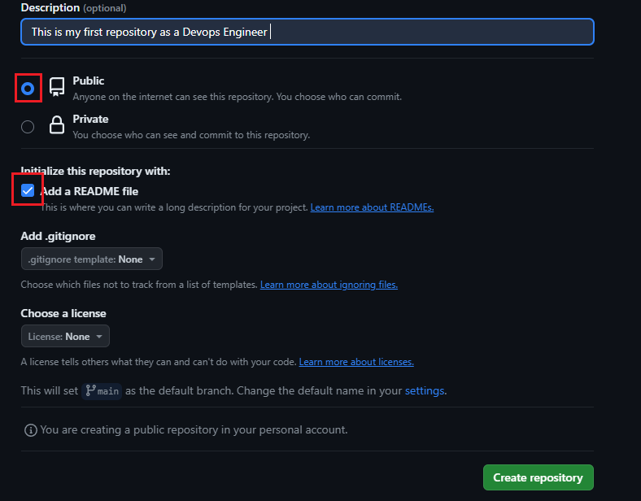
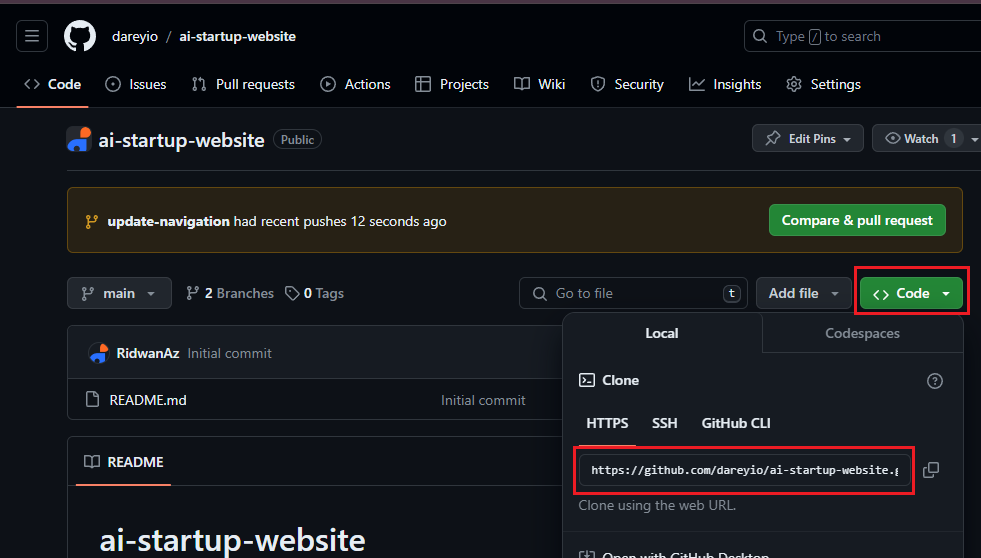
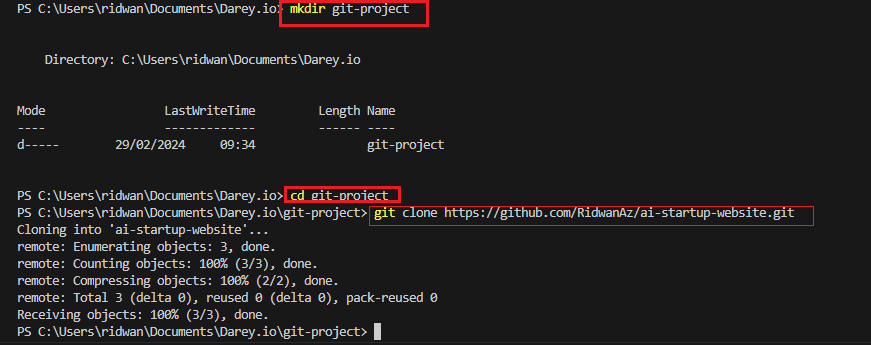
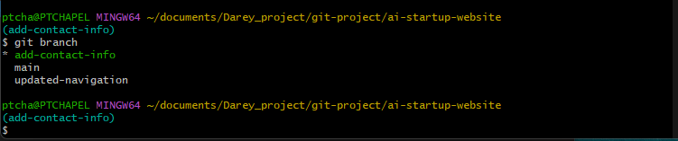
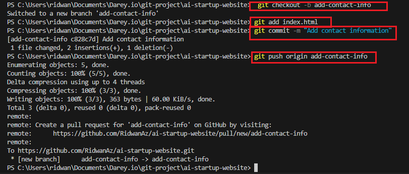
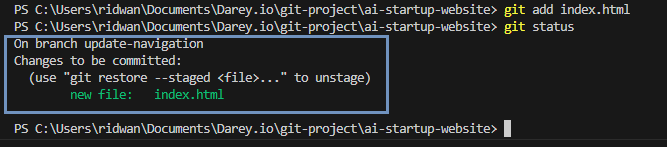
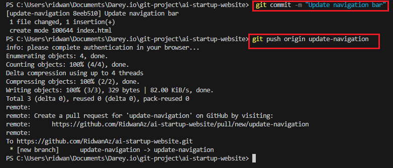

# Collaborative Website Developments with Git and GitHub

This project simulates a collaborative workflow between Tom and Jerry using Git, focusing on navigation updates and contact information additions.

## 1. Creating a GitHub Repository

1.  Created a new repository on GitHub.
    * 
    * 

## 2. Cloning the Repository

1.  Cloned the repository to my local machine.
    * 
    * 

## 3. Branch Creation and Switching

1.  Created branches for navigation updates and contact info.
    * 

## 4. Tom's Work (Navigation Updates)

1.  Tom added and committed changes.
    * 
2.  Tom checked git status.
    * 
3.  Tom pushed changes to GitHub.
    * 

## 5. Jerry's Work (Contact Info Updates)

1.  Jerry updated contact info files.
    * 

   ## 6. Pulling and Pushing to Main

1.  Pulled changes to the main branch.
    * 

## 7. Commit History