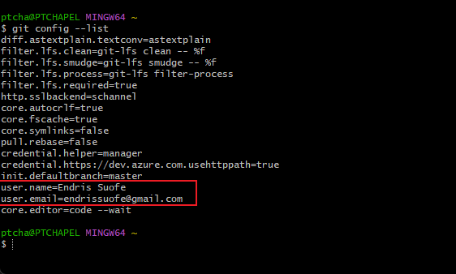
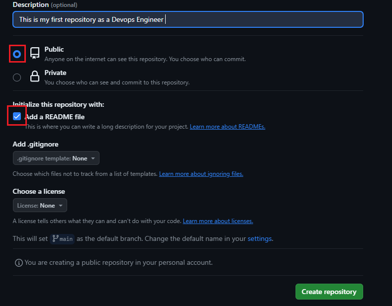
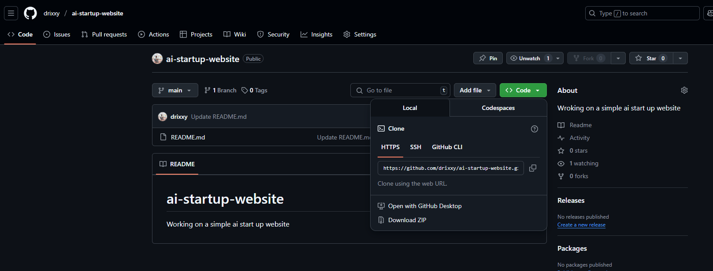
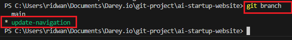
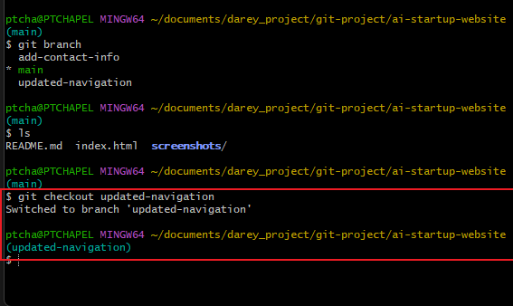
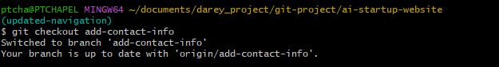
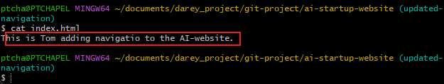
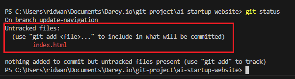
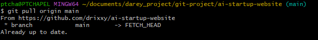
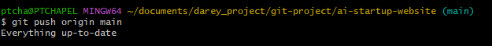

# Git Workflow Simulation: Tom and Jerry (Navigation and Contact Info)

**GitHub Repository URL:** https://github.com/drixxy/ai-startup-website/blob/main/README.md

This project simulates a collaborative workflow between Tom and Jerry using Git and GitHub, focusing on navigation updates and contact information additions, as per the instructor's requirements.

## 1. Git Setup and Initialization

1.  **Configuring Git User Credentials:**
    * To configure Git with my user credentials, I used the following commands:
        * `git config --global user.name "Your Name"`
        * `git config --global user.email "your.email@example.com"`
    * 
    

## 2. Creating a GitHub Repository

1.  Created a new repository on GitHub.
    * 
    * 

## 3. Cloning the Repository

1.  Cloned the repository to my local machine.
    * 
    * 

## 4. Repository Cloning & Branching

1.  **Creating Branches for Tom and Jerry:**
    * Created `updated-navigation` branch for Tom's work and `add-contact-info` branch for Jerry's work.
        * `git branch updated-navigation`
        * `git branch add-contact-info`
    * 
2.  **Switching to Tom's Branch:**
    * Switched to the `updated-navigation` branch: `git checkout updated-navigation`
    * 
3.  **Switching to Jerry's Branch:**
    * Switched to the `add-contact-info` branch: `git checkout add-contact-info`
    * 

## 5. Tom's Workflow Implementation

1.  **Tom's Navigation Updates:**
    * Tom updated the `index.html` file to add navigation content.
    *  
2.  **Tom's Commit:**
    * Tom added and committed his changes with a clear commit message:
        * `git add index.html`
        * `git commit -m "Added navigation to AI-website"`
    * 
3.  **Tom's Git Status:**
    * Tom checked the git status.
    * 
4.  **Tom's Push:**
    * Tom pushed his changes to GitHub.
    * 

## 6. Jerry's Workflow Implementation (20/20)

1.  **Jerry's Contact Info Updates:**
    * Jerry updated the `index.html` file to add a contact information section to the page.
    *  (Highlight the code changes in the screenshot)
2.  **Jerry's Commit:**
    * Jerry added and committed his changes with a clear commit message:
        * `git add index.html`
        * `git commit -m "Added contact information"`
    * 
3.
    

## 7. Pulling and Pushing to Main

1.  Pulled changes to the main branch.
    * `git checkout main`
    * `git pull origin main`
    * 
2.  Pushed changes to the main branch.
    * `git push origin main`
    * 

## 8. Commit History