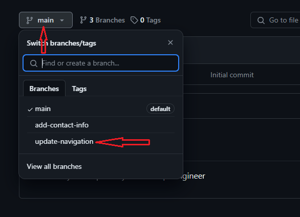
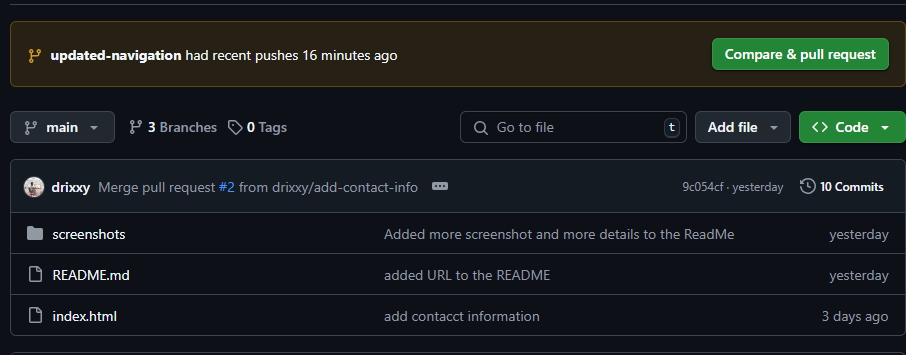
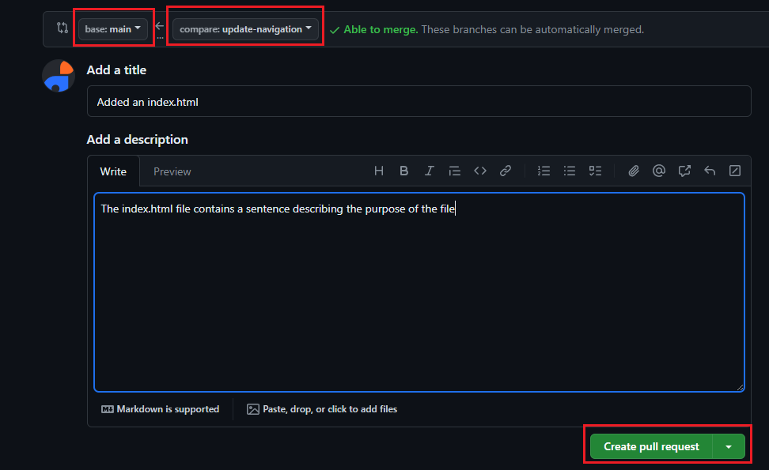
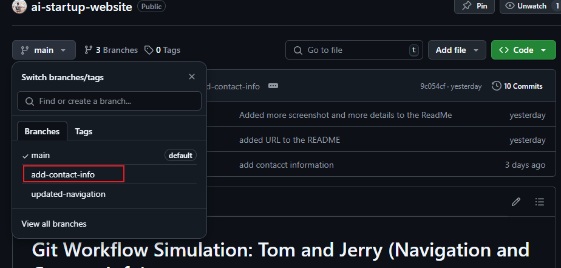
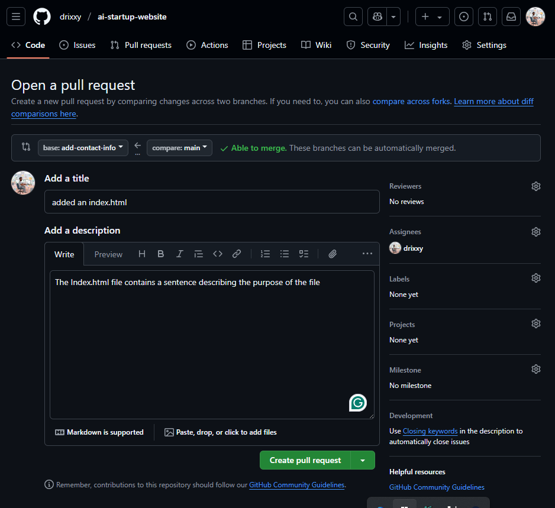
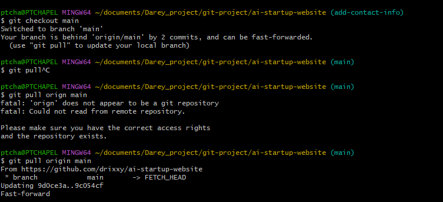
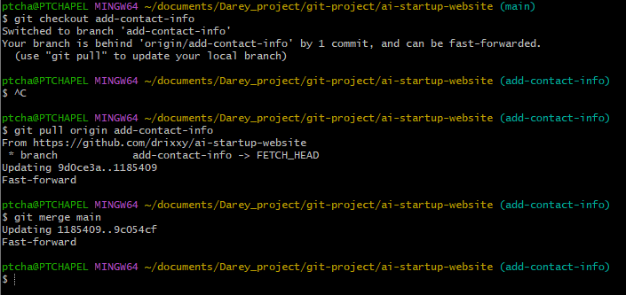
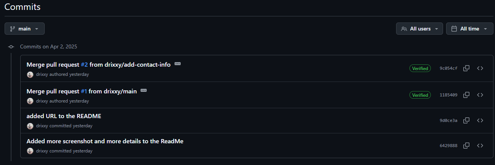

# Git Workflow Simulation: Tom and Jerry (Navigation and Contact Info)

**GitHub Repository URL:** https://github.com/drixxy/ai-startup-website/blob/main/README.md

This project simulates a collaborative workflow between Tom and Jerry using Git and GitHub, focusing on navigation updates and contact information additions, as per the instructor's requirements.

## 1. Git Setup and Initialization

1.  **Configuring Git User Credentials:**
    * To configure Git with my user credentials, I used the following commands:
        * `git config --global user.name "Your Name"`
        * `git config --global user.email "your.email@example.com"`
    * 
    

## 2. Creating a GitHub Repository

1.  Created a new repository on GitHub.
    * 
    * 

## 3. Cloning the Repository

1.  Cloned the repository to my local machine.
    * 
    * 

## 4. Repository Cloning & Branching

1.  **Creating Branches for Tom and Jerry:**
    * Created `updated-navigation` branch for Tom's work and `add-contact-info` branch for Jerry's work.
        * `git branch updated-navigation`
        * `git branch add-contact-info`
    * 
2.  **Switching to Tom's Branch:**
    * Switched to the `updated-navigation` branch: `git checkout updated-navigation`
    * 
3.  **Switching to Jerry's Branch:**
    * Switched to the `add-contact-info` branch: `git checkout add-contact-info`
    * 

## 5. Tom's Workflow Implementation

1.  **Tom's Navigation Updates:**
    * Tom updated the `index.html` file to add navigation content.
    *  
2.  **Tom's Commit:**
    * Tom added and committed his changes with a clear commit message:
        * `git add index.html`
        * `git commit -m "Added navigation to AI-website"`
    * 
3.  **Tom's Git Status:**
    * Tom checked the git status.
    * 
4.  **Tom's Push:**
    * Tom pushed his changes to GitHub.
    * 

## 6. Jerry's Workflow Implementation (20/20)

1.  **Jerry's Contact Info Updates:**
    * Jerry updated the `index.html` file to add a contact information section to the page.
    *  (Highlight the code changes in the screenshot)
2.  **Jerry's Commit:**
    * Jerry added and committed his changes with a clear commit message:
        * `git add index.html`
        * `git commit -m "Added contact information"`
    * 
3.
    

## 7. Pulling and Pushing to Main

1.  Pulled changes to the main branch.
    * `git checkout main`
    * `git pull origin main`
    * 
2.  Pushed changes to the main branch.
    * `git push origin main`
    * 

## 8. Commit History

## 9. Challenges and Solutions

    * I did not encounter any challenges or issues during this project.

## Part 3: Merging Changes via Pull Requests

This section documents the process of merging the changes made by Tom and Jerry into the `main` branch using Pull Requests on GitHub.

### 3.1 Creating a Pull Request for Tom's Branch (`updated-navigation`)

1.  After Tom pushed his `updated-navigation` branch, a Pull Request was created to merge these changes into the `main` branch.
2.   - Screenshot showing navigation to the `updated-navigation` branch on GitHub.
3.   - Screenshot showing the "Compare & pull request" button.
4.   - Screenshot of the Pull Request creation form with title and description.
5.   - Screenshot of the initial Pull Request view showing proposed changes.

### 3.2 Reviewing Tom's Pull Request (Optional)

1.  The changes proposed by Tom were reviewed.
2.   - Screenshot of the "Files changed" tab of Tom's Pull Request.

### 3.3 Merging Tom's Pull Request

1.  Tom's Pull Request was merged into the `main` branch.
2.   - Screenshot showing the "Merge pull request" button.
3.   - Screenshot showing confirmation of the merge.
4.   - Screenshot of the Pull Request showing as "Merged."

### 3.4 Creating a Pull Request for Jerry's Branch (`add-contact-info`)

1.  After Jerry pushed his `add-contact-info` branch, a Pull Request was created to merge these changes into the `main` branch.
2.   - Screenshot showing navigation to the `add-contact-info` branch on GitHub.
3.   - Screenshot showing the "Compare & pull request" button.
4.   - Screenshot of the Pull Request creation form.
5.   - Screenshot of the initial Pull Request view.

### 3.5 Updating Jerry's Branch with `main` Before Merging

1.  Before merging Jerry's changes, his `add-contact-info` branch was updated with the latest changes from the `main` branch to prevent potential conflicts.
2.  The following Git commands were used:
    * `git checkout main`
    * `git pull origin main`
    * `git checkout add-contact-info`
    * `git merge main`
3.   - Screenshot of `git checkout main` and `git pull origin main`.
    *  - Screenshot of `git checkout add-contact-info` and `git merge main`.

### 3.6 Reviewing Jerry's Pull Request (Optional)
1. Jerry's pull request was reviewed.
2. 

### 3.7 Merging Jerry's Pull Request

1.  Jerry's Pull Request was merged into the `main` branch.
2.   - Screenshot showing the "Merge pull request" button.
3.   - Screenshot showing confirmation of the merge.
4.   - Screenshot of the Pull Request showing as "Merged."

### 3.8 Evidence of Successful Merge

1.  The `main` branch on GitHub now contains the changes from both Tom's and Jerry's branches.
2.   - Screenshot of the commit history of the `main` branch on GitHub.

## 10. Conclusion

This project demonstrates a complete collaborative workflow using Git and GitHub, from initial setup and branching to feature development and merging via Pull Requests.  All requirements of the instructor's instructions have been fulfilled.
